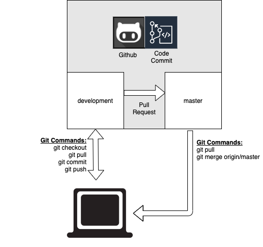

# Working With Branches
- Checkout the working branch
```bash
git checkout development
git pull origin development
```

- Sync / Merge from master (or) parent Branch
```bash
git pull origin master
git merge origin/master -m "Merge changes from master"
git push origin development
```

- Make Changes

```bash
git add . (or specify <filename>)
git commit -m "Add simple commit message"
git push --set-upstream origin development
```



# The seven rules of a great Git commit message
Keep in mind: This has all been said before.

- Separate subject from body with a blank line
- Limit the subject line to 50 characters
- Capitalize the subject line
- Do not end the subject line with a period
- Use the imperative mood in the subject line
- Wrap the body at 72 characters
- Use the body to explain what and why vs. how
